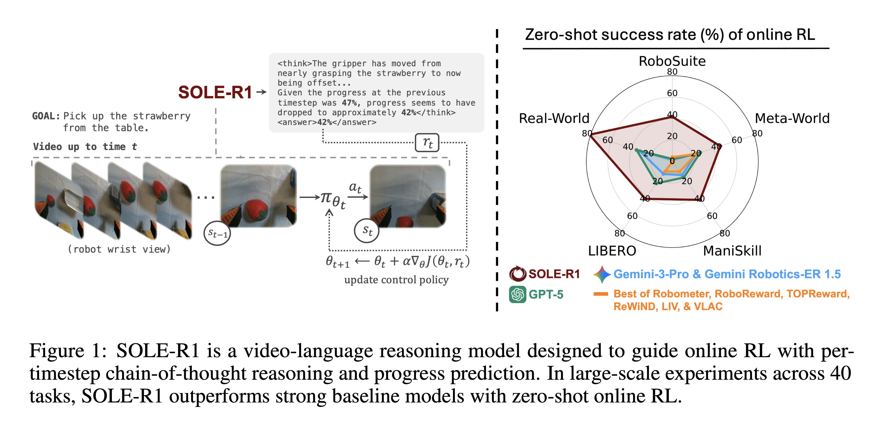

<h1 align="center">
  SOLE-R1: Video-Language Reasoning as the<br>
  Sole Reward for On-Robot RL
</h1>

This is the repository for the paper:

> SOLE-R1: Video-Language Reasoning as the Sole Reward for On-Robot RL
>
> Philip Schroeder, Thomas Weng, Karl Schmeckpeper, Eric Rosen, Stephen Hart, Ondrej Biza

SOLE-R1 is a video-language reasoning model designed for guiding online RL with per-timestep chain-of-thought reasoning and progress prediction.

<p align="center">
  
</p>

---
### Paper (arXiv)
https://arxiv.org/abs/2603.28730

### Project page
https://philip-mit.github.io/sole-r1/


## Example video

<!-- <video src="assets/robosuite_lift_episode_12_unsuccessful_max_reward_38.mp4" controls></video> -->
<!-- https://github.com/user-attachments/assets/0d804a7d-c00a-4206-98be-421c91329f8e -->

https://github.com/user-attachments/assets/4df13587-2fdf-4635-b0af-00daeed0be7e


## 🚀 Quick Start
[RoboReason](https://github.com/Philip-MIT/roboreason) provides the easiest way for downloading and using SOLE-R1, along with other recent reward models such as Robometer, RoboReward, and TOPReward.
```python
# install package: pip install -U roboreason 
# or clone repo: git clone https://github.com/Philip-MIT/roboreason

import roboreason as rr

video_paths = ["path/to/your/robot_video.mp4"]
task_description = "Describe the robot task here, e.g., close the left drawer."

# Generate SOLE-R1 task-progress rewards and per-timestep reasoning traces.
# Use view_type_per_video='external and wrist' when the video contains both views.
rewards, reasoning_traces = rr.generate(
    model="SOLE-R1",
    task_description=task_description,
    video_paths=video_paths,
    view_type_per_video=["external and wrist"],
    verbose=False,
)

print("Predicted task-progress rewards:")
print(rewards[0])

print("\nFirst reasoning trace:")
print(reasoning_traces[0][0])

# Optional: save a video visualization with predicted rewards / reasoning.
rr.video_plot(
    outputs=[
        {
            "model": "SOLE-R1",
            "rewards": rewards[0],
            "reasoning_traces": reasoning_traces[0],
        }
    ],
    video_path=video_paths[0],
    plot_save_path="sole_r1_output.mp4",
    verbose=False,
)
```

<!-- ## 🎥 Demos

Example videos demonstrating SOLE-R1 frame-level reasoning and task progress prediction can be found at:

https://philip-mit.github.io/sole-r1/

--- -->

## Model Checkpoints

Final model checkpoint available in HF format at [SOLE-R1-8B](https://huggingface.co/Philip-MIT/SOLE-R1-8B) 

---

## Training Dataset

Full training dataset (2TB) is available in HF format at [sole_training_data](https://huggingface.co/datasets/Philip-MIT/sole_training_data) 

### Streaming
```python
from datasets import load_dataset

ds = load_dataset(
    "Philip-MIT/sole_training_data",
    split="train",
    streaming=True,
)

# Print one example
for row in ds:
    print(row)
    break
    # {
    #     'image': <PIL.PngImagePlugin.PngImageFile image mode=RGB size=1176x784 at 0x7F5F26A107C0>, 
    #     'prompt': '[{"role": "system", "content": "You are an expert roboticist with the goal of predicting task progress percentages given frames from a video of a robot attempting to complete a task. You first think, in the form of an internal monologue, before providing your final answer. Your reasoning process MUST BE enclosed within <think> </think> tags and should include detailed reasoning. Your final answer MUST BE enclosed within <answer> </answer> tags and should be a integer (positive or negative) representing current task progress percentage. Example output format: <think>[detailed reasoning process]</think><answer>[current task progress]%</answer>"}, {"role": "user", "content": [{"type": "image"}, {"type": "text", "text": "Here is an image containing multiple camera views of a robot attempting to complete a task. The views on the top are from an external camera. The views on the bottom are from the robot\'s wrist camera. The views from the very first timestep are shown to the left. The views from the previous timestep are shown in the middle. The views from the current timestep are shown to the right. The task description is: close the left drawer. The task progress for the very first timestep is 0%. The task progress for the previous timestep is 0%. Predict the task progress for the current timestep."}]}, {"role": "assistant", "content": [{"type": "text", "text": "<think>At the previous timestep, the left drawer is open and the gripper is off to the side with no contact to the drawer or its handle. At the current timestep, the gripper has shifted slightly closer to the face of the left drawer while still not making contact, and the drawer remains open. This small approach suggests initial progress toward closing the drawer. Given the previous task progress of 0%, I would predict the current task progress to be about 1%. To complete the task, the robot still needs to reach the drawer front or handle, establish contact, and push the drawer fully shut.</think><answer>1%</answer>"}]}]', 
    #     'solution': '<think>At the previous timestep, the left drawer is open and the gripper is off to the side with no contact to the drawer or its handle. At the current timestep, the gripper has shifted slightly closer to the face of the left drawer while still not making contact, and the drawer remains open. This small approach suggests initial progress toward closing the drawer. Given the previous task progress of 0%, I would predict the current task progress to be about 1%. To complete the task, the robot still needs to reach the drawer front or handle, establish contact, and push the drawer fully shut.</think><answer>1%</answer>', 
    #     'image_name': 'CloseDrawer_demo_526_lev7-two-two_timestep_0_8.jpg', 
    #     'from_annotation': 1, 
    #     'completion': '<think>At the previous timestep, the left drawer is open and the gripper is off to the side with no contact to the drawer or its handle. At the current timestep, the gripper has shifted slightly closer to the face of the left drawer while still not making contact, and the drawer remains open. This small approach suggests initial progress toward closing the drawer. Given the previous task progress of 0%, I would predict the current task progress to be about 1%. To complete the task, the robot still needs to reach the drawer front or handle, establish contact, and push the drawer fully shut.</think><answer>1%</answer>', 
    #     'data_source': 'processed_0717_annot2_CloseDrawer_sft_hf'
    # }
```


### Dowloading the full dataset (2TB) to a local directory
```python
from huggingface_hub import snapshot_download

local_path = snapshot_download(
    repo_id="Philip-MIT/sole_training_data",
    repo_type="dataset",
    local_dir="/path/to/local/sole_training_data",
)
```
---


## Reward Server

See [reward_server/README.md](reward_server/README.md) for full setup, usage, and API documentation.

---

## Reward Client

See [reward_client/README.md](reward_client/README.md) for full setup and usage documentation.

---

## 📚 Citation

If you use SOLE-R1 data or models in your research, please cite:

    @article{schroeder2026soler1,
        title         = {SOLE-R1: Video-Language Reasoning as the Sole Reward for On-Robot Reinforcement Learning},
        author        = {Schroeder, Philip and Weng, Thomas and Schmeckpeper, Karl and Rosen, Eric and Hart, Stephen and Biza, Ondrej},
        journal       = {arXiv preprint arXiv:2603.28730},
        year          = {2026},
        eprint        = {2603.28730},
        archivePrefix = {arXiv},
        primaryClass  = {cs.RO},
        doi           = {10.48550/arXiv.2603.28730},
        url           = {https://arxiv.org/abs/2603.28730}
    }


## 📄 License

This project is released under the MIT License unless otherwise specified.  
<!-- See the LICENSE file for details. -->

---

## 🙋 Contact

For questions or issues, please open a GitHub Issue or contact the authors directly.

---

